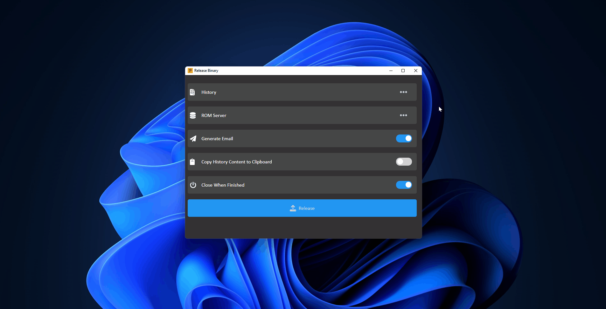

# Release Binary

An Electron app that

- Capture latest History content
- Move binary file to certain folder on server
- Generate email draft by latest History content
- Copy latest History content to clipboard

## Usage

